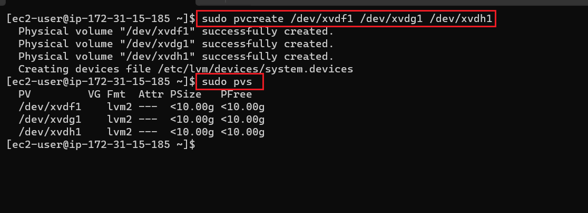
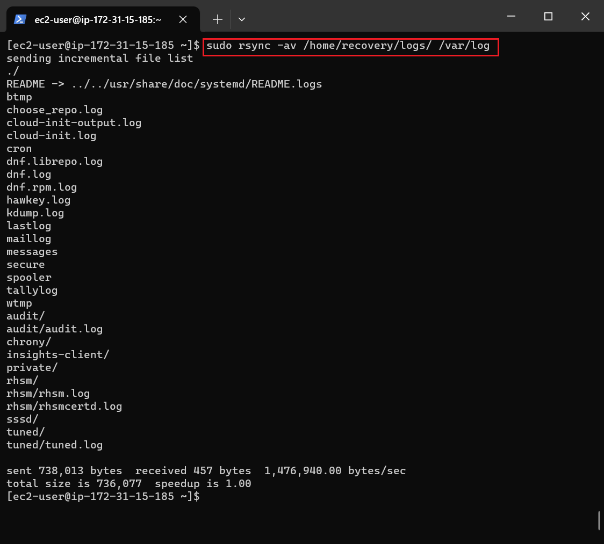
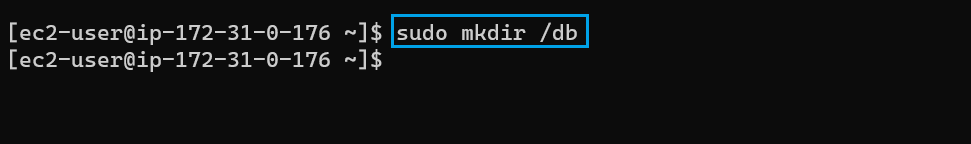

# Implementing-Wordpress-Web-Solution

In this project we will be preparing storage infrastructure on two **RedHat servers** and implement a basic web solution using *wordpress*. This project consists of two parts:

1. Configuring storage subsystems for web and database servers based on Redhat.
2. Installing wordpress and connecting it to a remote MYSQL database server.

This project presents a **Three-tier Architecture** pattern that comprises 3 separate layers. as shown below 

## STEP 1 Preparing Web Server

First we create 2 EC2 RedHat servers for the web and database as shown below 

On the EBS console, we then create and attach 3 storage volumes for the web server instance. This serves as additional external storage to our EC2 machine in addition to the root volume created at the launch of the EC2 instance as shown below 
we then SSH into the instance and on the EC2 terminal, view the disks attached to the instance `lsblk` command as shown below 
For us to be able to create a block of EBS volume that we can increase and decrease as required without needing to stop our server we will need to create logical volumes `lv` on partitions created on all the storage volumes using the `gdisk` command on the `xvdf, xvdg, xvdh....` volumes as shown below  
 
we then confirm the partitions by running `lsblk` command as shown below


To be able to create logical volumes `lv` we have to create physical volumes on the partitions created to do this we need to install the `lvm2` package by running `sudo yum install lvm2` as shown below  
we then create Physical Volumes on the partitioned disk volumes by running `sudo pvcreate {disk partition} {disk partition}` and we confirm the physical volume created by running `sudo pvs` as shown below 
On the physical volume created we then have to group the **Volume Group** to form a volume block (group) that sums up the volumes of all the added disks this can aslo be increased and decreased as desired. this can be don by running `sudo vgcreate {desired_group_name} [volume_partitions_to_be_grouped]` as shown below  as shown we can confirm the volume group created by running `sudo vgs`.

Finally we then create create the logical volumes for the web and logs and apportion volume sizes to the logical volumes by running `sudo lvcreate -n {logical_volume_name} -L [size] volume_group` as shown below


For this project (designing a wordpress web solution) we will be using `ext4` file system to format the logical volumes by running `sudo mkfs -t ext4 [logical_volume_directory]` as shown below 

To progress we need to provide a location to store the wordpress configuration files as well as the log files for the web server and this is done by running `sudo mkdir -p [proposed_location]` as shown below 
### Mounting Logical Volumes
It is best practice to confirm that the the directory to be mounted upon is empty before mounting on it.

At this point we need to mount the newly created file location for the webserver on the logical volume created by running `sudo mount [web_logical_volume_dirctory] {new_file_location}` and confirm that success by running `df -h` as shown below 

However for the logs logical volume we need to mount it on `/var/log/` and this is usually not empty. we can confirm this by running `sudo ls -l` as shown below 
Since the location `/var/log/` is not empty we need to copy out the content of the directory before mounting on it by running the command `sudo rsync /var/log/. [newly_created_log_directory]` *note* to copy content of the file use `/.` as shown below 
At this point we can proceed to mount the logical volume on the `/var/log` directory by running `sudo mount [logs_logical_volume_directory] /var/log` command as show below 
we then copy back the content of the /var/log directory from the newly_created_log_directory by running `sudo rsync [newly_created_log_directory] /var/log/` command as shown below 

To persist the mount configuration we need to update the `/etc/fstab` but first we need to get the UUID for the web server and log files by running `sudo blkid` as shown below 
we then update the /etc/fstab/ file with the UUID by running `sudo vi /etc/fstab` as shown below 

Finally we test the configuration by running `sudo mount -a` and reload the configuration by running `sudo systemctl deamon-reload` as shown below  

## STEP 2 Preparing the Database Server

Just like we did for the web server we created and attached 3 EBS storages to the database EC2 as shown below  

Also just like the web server we SSH into the EC2 on our terminal and proceed to partition the attached disks using the `gdisk` command as shown below  

Also we install the `lvm` to enable us create a database logical volume through physical volumes and volume groups as shown below 

However for the database logical volume we only need to create a logical volume for the database as we are not serving the content of the database directly on the web. Hence we apportion the volume group to the database as shown below 
we then proceed to make a databse directory by running `sudo mkdir [database_directory_name]` as shown below 

we also create an `ext4` file system for the database directory as shown below 

we then mount the database logical volume on the new databse directory as shown below  

To persist the mount configuration we need to update the `/etc/fstab` but first we need to get the UUID for the web server and log files by running `sudo blkid` as shown below 
We then update the /etc/fstab/ file with the UUID by running `sudo vi /etc/fstab` we test the configuration by running `sudo mount -a` and reload the configuration by running `sudo systemctl deamon-reload` as shown below as shown below 

## STEP 3 Configuring Wordpress Web Server

We run updates and install apache (httpd) on web server by running the command below 
```
yum install -y update
sudo yum -y install wget httpd php php-mysqlnd php-fpm php-json
```
as shown below  

On the AWS terminal by ensuring that we add port `3306` on our db server to allow our web server to access the database server  we also open port `80` on the web server to allow access to the web server form the browser as shown below 
Then start the apache server by running the `sudo systemctl start httpd` and `sudo systemctl status httpd` as shown below 

we then proceed to install php and its dependencies by running the following commands 
```
{
sudo yum install https://dl.fedoraproject.org/pub/epel/epel-release-latest-8.noarch.rpm
sudo yum install yum-utils http://rpms.remirepo.net/enterprise/remi-release-8.rpm
sudo yum module list php
sudo yum module reset php
sudo yum module enable php:remi-7.4
sudo yum install php php-opcache php-gd php-curl php-mysqlnd
sudo systemctl start php-fpm
sudo systemctl enable php-fpm
setsebool -P httpd_execmem 1
}
```
as shown below   
We then restart php as shown below  

Finally we test the configuration by browsing the public IP of the web server on our browser as shown below 

### Installing Wordpress Server
to install the wordpress application we need to first make a wordpress directory by running `mkdir wordpress`and then change directory to the wordpress directory as shown below  

We then install the wordpress application on the on the new wordpress directory by running the following commands 
```
{
sudo wget http://wordpress.org/latest.tar.gz
sudo tar xzvf latest.tar.gz
}
```


As shown below 

We will now confirm the the content of the wordpress directory by running `ls -l` where we will see the downloaded wordpress folder and now change directory to the downloaded folder by running `cd wordpress` and confirming the content of the directory by running `ls -l` command as show below 

### Configuring the wordpress folder
Here we will configure the downloaded wordpress folder by copying the content of `wp-config-sample.php` to a newly created folder `wp-config.php`. this is done by running `sudo cp wp-config-sample.php wp-config.php`command as shown below 
We then copy the content of the downloaded wordpress directory to the directory created for the wordpress configuration files earlier and we then change directory to the directory by running the `cd` command as shown below 

## STEP 4 Installing MySQL on DB Server
We first install mysql on the database server by running `sudo yum install mysql-server` as shown below 

we then start and enable the mysql server by running `sudo systemctl start mysqld`, `sudo systemctl enable mysqld` and we then check the status by running `sudo systemctl status mysqld`command as shoen below 

we then access the mysql database by running `sudo mysql` command as shown below  

we then run the following commands to configure the database 
```
{
CREATE DATABASE <database_name>;
CREATE USER `<myuser_name>`@`<Web-Server-Private-IP-Address>` IDENTIFIED BY '<password>';
GRANT ALL ON <database_name>.* TO '<myuser_name>'@'<Web-Server-Private-IP-Address>';
FLUSH PRIVILEGES;
SHOW DATABASES;
}
```
as shown below 
 to provide adequate acces to the database drom the web server we need to edit the database configuration on */etc/my.cnf* by running `sudo /etc/my.cnf` command we then proceed to update the file by adding  
 ```
{
[mysqld]
bind-address=0.0.0.0
}
```


### Starting Wordpress on the Web server

On the web server we confirm the content of the new wordpress directory created to be sure that the configuration of the wordpress server is securely stored on the folder as shown below 

we then run the following commands `sudo vi wp-config.php` and then restart apache by running `sudo systemctl restart httpd` as shown below 
we then remove the default apache home page to enable the wordpress server display the wordpress content by running the command `sudo mv /etc/httpd/conf.d/welcome.conf /etc/httpd/conf.d/welcome.conf_backup` as shown below 

We then connect to the database server through the web server by running `sudo mysql -u <my_username> -h <database_server_private_IP> -p` as shown below 

### Configure SELinux Policies
We then grant apache permission to access all configuration files for the wordpress server saved in the directory created for the updated wordpress files. by running the command `sudo chown -R apache:apache /var/www/html/wordpress` as shwn below  we will then run the following commands `sudo chcon -t httpd_sys_rw_content_t /var/www/html -R` and then `sudo setsebool -P httpd_can_network_connect=1` as shown below 

Finally we refresh the public IP of our webserver EC2 on the web browser to access the wordpress server as shown below 
and we can save user details on the database by accessing the login page of the website as shown below 


